# SafeTrack: IoT-Based Child Safety Monitoring System with AI-Assisted Parental Guidance

SafeTrack is an integrated child safety monitoring system that combines a custom-built
IoT tracker device with a real-time mobile application, an always-on Python monitoring
server, and an AI-powered assistant. The system is designed to provide parents of
elementary school students with continuous visibility into their child's location,
safety status, and route compliance — particularly during school commutes and within
school premises.

---

## Table of Contents

1. [Overview](#overview)
2. [Problem Being Solved](#problem-being-solved)
3. [Project Goals](#project-goals)
4. [System Components](#system-components)
5. [System Architecture](#system-architecture)
6. [Alert Types](#alert-types)
7. [Geofencing & Deviation Detection](#geofencing--deviation-detection)
8. [AI Assistant](#ai-assistant)
9. [Circuit Diagram](#circuit-diagram)
10. [3D Model](#3d-model)
11. [App UI Screenshots](#app-ui-screenshots)
12. [Downloads](#downloads)
13. [Development Environment](#development-environment)
14. [Repository Structure](#repository-structure)
15. [Acknowledgments](#acknowledgments)

---

## Overview

SafeTrack addresses a critical gap in child safety monitoring: the period between
when a child leaves home and when they arrive at school, and vice versa. Using a
combination of GPS tracking, 4G LTE connectivity, Firebase cloud infrastructure,
a Python monitoring server, Haversine-based geofencing, and Google Gemini AI,
SafeTrack delivers real-time alerts, route deviation detection, and intelligent
contextual answers to parental safety queries.

The system follows a clear separation of responsibilities:

| Component | Role |
|---|---|
| **IoT Device** | Collects and transmits GPS + status data |
| **Firebase RTDB** | Single source of truth — shared state |
| **Python Server** | Sole monitor and informer — detects events, sends alerts |
| **Flutter App** | Displayer only — receives notifications, shows history |

---

## Problem Being Solved

The safety of elementary school children during their daily commute and within school
campuses remains a persistent concern for parents and guardians. Conventional monitoring
methods — such as phone calls or manual check-ins — are unreliable, disruptive, and
provide no real-time spatial awareness. Existing commercial GPS trackers often lack
intelligent alert systems, require expensive subscription plans, or depend on
infrastructure not readily available in developing regions.

Additionally, app-based background monitoring (via Android Workmanager) is fundamentally
unreliable due to OS-level battery optimization, Doze mode, and OEM restrictions —
making it unsuitable as the sole detection mechanism for a safety-critical system.

SafeTrack proposes a low-cost, locally deployable, server-augmented, and AI-assisted
solution tailored to the needs of parents who want affordable and reliable child monitoring.

---

## Project Goals

1. Design and develop a custom IoT tracker device capable of real-time GPS tracking
   and 4G LTE data transmission.
2. Build a cross-platform mobile application for parents to receive alerts, view
   child location, and manage devices.
3. Implement an always-on Python monitoring server as the sole detection layer,
   replacing unreliable Android background tasks.
4. Implement a Haversine-based route deviation detection algorithm with configurable
   thresholds, running server-side.
5. Integrate a context-aware AI assistant to answer parental safety questions using
   real-time device data and reverse geocoding.
6. Evaluate system accuracy, response latency, and battery performance under
   real-world conditions.

---

## System Components

### 1. IoT Tracker Device

The hardware component is a custom-built portable device carried by the child.
It is designed to be compact, durable, and power-efficient.

**Hardware Components:**

| Component | Specification | Purpose |
|---|---|---|
| ESP32-C3 Super Mini | RISC-V 160MHz, Wi-Fi + BLE | Main microcontroller |
| SIM7600E-H1C | 4G LTE Cat-4, integrated GPS | Cellular data + GPS receiver |
| MAX17043 | I²C LiPo fuel gauge | Battery percentage monitoring |
| TP4056 | 1A LiPo charging module | Safe battery charging |
| MT3608 | DC-DC boost converter | Regulates 3.7V → 5V for SIM module |
| LiFePO4 Battery | 3.7V, 2000mAh | Primary power source (~8–12hr) |
| Push Button | Momentary tactile switch | SOS / emergency trigger (hold 3s) |

**Firmware (v4.4):**
- Written in C/C++ using the Arduino framework for ESP32
- Reads GPS NMEA sentences from the SIM7600E-H1C via UART
- Reads battery percentage from MAX17043 via I²C
- Detects SOS button press via GPIO (3-second hold to activate)
- Transmits JSON payload to Firebase RTDB via HTTPS POST over 4G LTE
- Transmission interval: every 2 minutes (SOS: immediate)
- SOS retry queue: stores failed SOS locally, retries when GPRS reconnects

**Sample Payload:**
```json
{
  "latitude": 10.316742,
  "longitude": 123.890561,
  "accuracy": 4.8,
  "speed": 0.0,
  "altitude": 11.2,
  "locationType": "gps",
  "batteryLevel": 84,
  "sos": false,
  "timestamp": { ".sv": "timestamp" },
  "lastUpdate": { ".sv": "timestamp" }
}
```

---

### 2. Firebase Backend

Firebase Realtime Database serves as the cloud backbone, providing:

- **Real-time data synchronization** between the IoT device, server, and parent app
- **Offline persistence** — the app caches the last known state when connectivity is lost
- **Scalable NoSQL structure** organized by user ID and device code
- **Firebase Authentication** for secure parent account management
- **Firebase Cloud Messaging (FCM)** for reliable push notifications to the parent's phone

**Key RTDB paths:**

| Path | Written by | Read by |
|---|---|---|
| `deviceLogs/{uid}/{code}/{pushId}` | Firmware | Server |
| `deviceStatus/{uid}/{code}` | Firmware | Server, App |
| `linkedDevices/{uid}/devices/{code}` | App | Server, App |
| `devicePaths/{uid}/{code}/{routeId}` | App | Server |
| `alertLogs/{uid}/{code}/{pushId}` | Server | App |
| `users/{uid}/fcmToken` | App | Server |
| `serverCooldowns/{uid}/{code}/...` | Server | Server |

---

### 3. Python Monitoring Server

The server is the **sole monitor and informer** in the SafeTrack system. It runs
continuously on the parent's laptop (or any always-on machine) and handles all
detection and notification logic independently of the parent's phone state.

**Why a dedicated server instead of Android background tasks:**

Android's Workmanager background tasks are subject to Doze mode, OEM battery killers,
and a minimum 15-minute interval — making them fundamentally unreliable for a
safety-critical application. The Python server bypasses all of these constraints
by running as a standalone process outside the Android ecosystem.

**Server monitors:**

| Monitor | Type | Detection |
|---|---|---|
| `sos_monitor.py` | Real-time RTDB listener | `deviceStatus/sos` field transition |
| `deviation_monitor.py` | Real-time RTDB listener | Haversine path deviation |
| `behavior_monitor.py` | Cron every 5 min | Late, absent, anomaly |
| `silence_monitor.py` | Cron every 5 min | Device heartbeat (lastUpdate) |

**Guard rules applied by all monitors:**
- `deviceEnabled == false` → skip device
- `locationType != 'gps'` → skip cached logs (deviation + behavior)
- `sos == true` → skip non-SOS checks during emergency
- Outside school hours → skip
- Cooldown not expired → skip

**Stack:** Python 3.10+, `firebase-admin==6.5.0`, `pytz==2024.1`

---

### 4. Parent Mobile Application

Built with **Flutter (Dart)** for cross-platform compatibility (Android primary target).

Under the server-primary architecture, the app is the **displayer only**:
- Receives FCM push notifications from the server
- Displays alert history from `alertLogs` via `AlertScreen`
- Shows live child location on interactive map
- Manages devices, routes, and school schedules
- Hosts the AI assistant

**Screens:**
- **Dashboard** — all linked children, battery, GPS, SOS status
- **Live Location** — real-time OpenStreetMap with route overlay
- **My Children** — device management, school schedule, route access
- **Route Registration** — tap-to-drop waypoint editor with threshold slider
- **Alerts** — full alert history with 7 filter chips (all types including `silent`)
- **AI Assistant** — Gemini-powered chat with Firebase context + reverse geocoding
- **Settings** — Help Center with embedded User Manual and notification guide

**Key services:**
- `notification_service.dart` — 3 FCM channels, `showFromFcm()`, `ValueNotifier` tap routing
- `auth_service.dart` — Firebase Authentication wrapper
- `haversine_service.dart` — used by route registration UI
- `gemini_service.dart` — Gemini API + Firebase context + Nominatim reverse geocoding

**State management:** Provider pattern
**Notifications:** `flutter_local_notifications` + Firebase Cloud Messaging
**Mapping:** `flutter_map` + OpenStreetMap (no API key required)

---

### 5. Geofencing & Deviation Detection

The system implements **path-based geofencing** rather than traditional circular
geofences, which are unsuitable for linear routes such as school commutes.

**Algorithm:**

1. The parent registers a route as an ordered sequence of GPS waypoints via the
   app's tap-to-drop map editor.
2. For each GPS update received from the child's device, the server calculates
   the **perpendicular distance** from the child's position to the nearest segment
   of the registered route.
3. Distance is computed using the **Haversine formula** for accurate great-circle
   calculations on Earth's curved surface.
4. If the distance exceeds the parent-configured threshold (20m–200m), a deviation
   alert is written to `alertLogs` and an FCM push is sent to the parent.

**Haversine formula:**
```
a = sin²(Δlat/2) + cos(lat₁) · cos(lat₂) · sin²(Δlon/2)
c = 2 · asin(√a)
d = R · c     where R = 6,371,000 m
```

**Why Haversine over Euclidean:**
Euclidean distance treats GPS coordinates as flat Cartesian coordinates, introducing
significant errors over distances greater than a few hundred meters. Haversine correctly
accounts for Earth's spherical geometry, providing meter-level accuracy suitable for
route monitoring.

**Perpendicular segment projection:**
For segment A→B and child position P:
1. Project P onto segment: `t = dot(P−A, B−A) / |B−A|²`
2. Clamp `t` to `[0, 1]` to stay within the segment
3. Nearest point = `A + t·(B−A)`
4. Distance = `Haversine(P, nearest_point)`
5. Minimum across all segments = child's deviation from route

---

### 6. AI Assistant

The AI component uses **Google Gemini API** with a retrieval-augmented generation
(RAG) approach.

**Features:**
- Fetches real-time device data from Firebase before each query (battery, location,
  SOS status, recent logs, active routes, recent alerts)
- **Reverse geocoding** via Nominatim (OpenStreetMap) — converts raw coordinates
  to human-readable place names (e.g., "near Osmeña Blvd, Cebu City") before
  injecting into the AI context
- Injects a hardcoded knowledge base covering system architecture, algorithms,
  and thesis context
- Classifies questions into categories (location, safety, device, reassurance,
  child status, technical) and handles broad temporal questions by requesting
  time-range clarification
- Supports natural language date parsing ("last week", "yesterday", "April 2025")
  for historical log queries
- Model switcher — parent can select between Fast, Balanced, and Most Accurate
  Gemini models
- Every response ends with a relevant follow-up question

---

## System Architecture

```
Child carries IoT device (ESP32-C3 + SIM7600 + GPS)
        │
        │  GPRS / 4G LTE
        ▼
Firebase Realtime Database
        │
        ├──► Python Server (always-on, parent's laptop)
        │         ├── sos_monitor       → writes alertLogs + FCM push
        │         ├── deviation_monitor → writes alertLogs + FCM push
        │         ├── behavior_monitor  → writes alertLogs + FCM push
        │         └── silence_monitor   → writes alertLogs + FCM push
        │                   │
        │                   ▼
        │           Firebase Cloud Messaging (FCM)
        │                   │
        └──► Flutter App (parent's phone — displayer only)
                  ├── receives FCM push → shows notification
                  ├── AlertScreen reads alertLogs → shows history
                  ├── LiveLocationsScreen reads deviceLogs → shows map
                  └── AI Assistant reads Firebase + reverse geocodes
```

---

## Alert Types

| Type | Trigger | Detection | Screen on Tap |
|---|---|---|---|
| 🆘 `sos` | Child holds emergency button 3s | Real-time, immediate | Live Location |
| ⚠️ `deviation` | Child moves off registered route | Real-time, 5-min cooldown | Live Location |
| ⏰ `late` | First GPS ping after grace period | Cron 5 min, once/day | Alerts |
| 📋 `absent` | Zero GPS during school hours | Cron 5 min, once/day | Alerts |
| ⚠️ `anomaly` | Movement after 22:00 or before 05:00 | Cron 5 min, once/day | Alerts |
| 📡 `silent` | No transmission for 15+ min | Cron 5 min, 30-min re-alert | Alerts |

---

## Circuit Diagram

<!-- Replace with your actual circuit diagram image -->
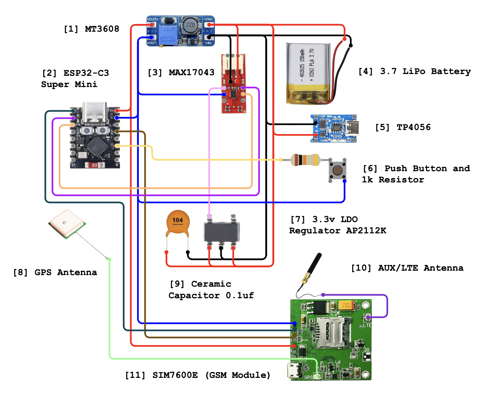

> Wiring diagram of the ESP32-C3 Super Mini connected to SIM7600E-H1C (UART),
> MAX17043 (I²C), TP4056 (charging), MT3608 (boost converter), and SOS button (GPIO).

---

## 3D Model

<!-- Replace with your actual 3D render screenshots -->

| Front | Back | Assembled |
|---|---|---|
| 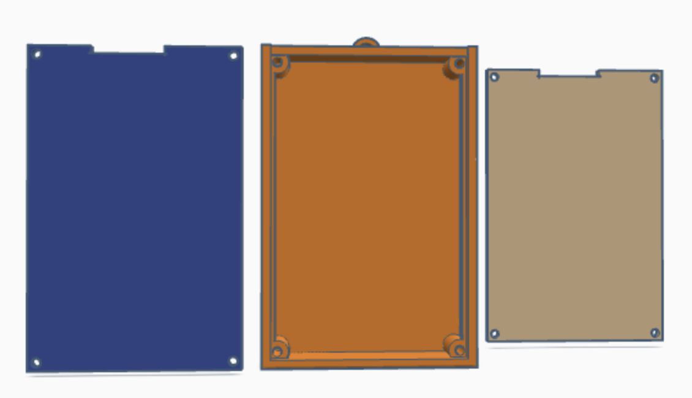 | 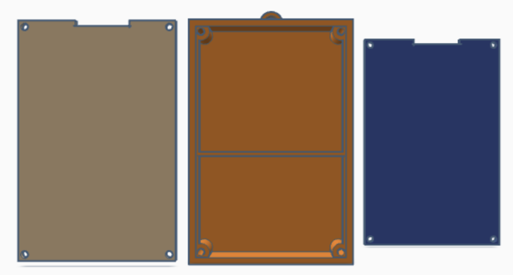 | 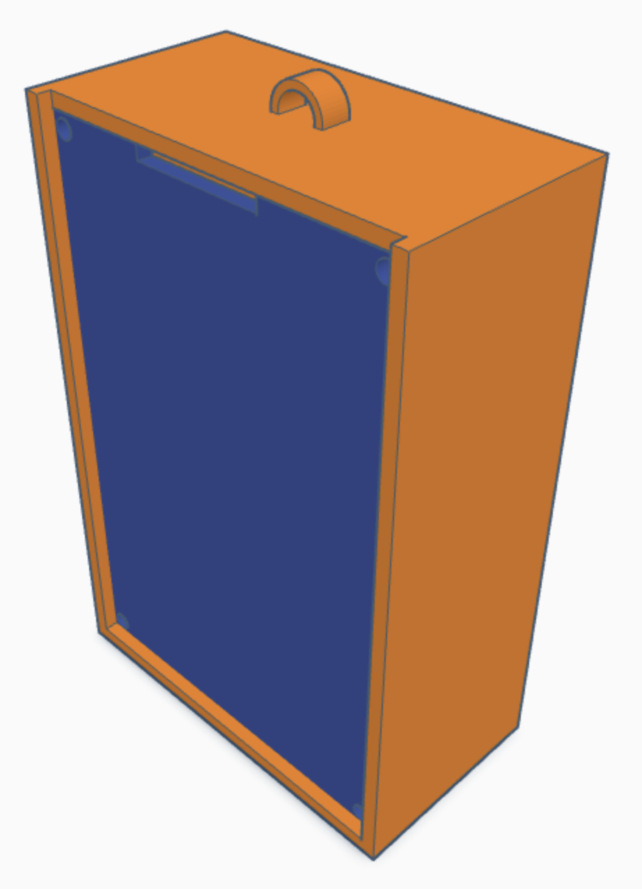 |

> **[⬇️ Download STL File (Google Drive)](https://drive.google.com/drive/folders/1EYjyFP11LW7h_nx68BAPlHHjCYp_BCfe)**
>
> Recommended print settings: PLA, 0.2mm layer height, 20% infill.

---

## App UI Screenshots

| Login | Sign Up | Dashboard |
|:---:|:---:|:---:|
| 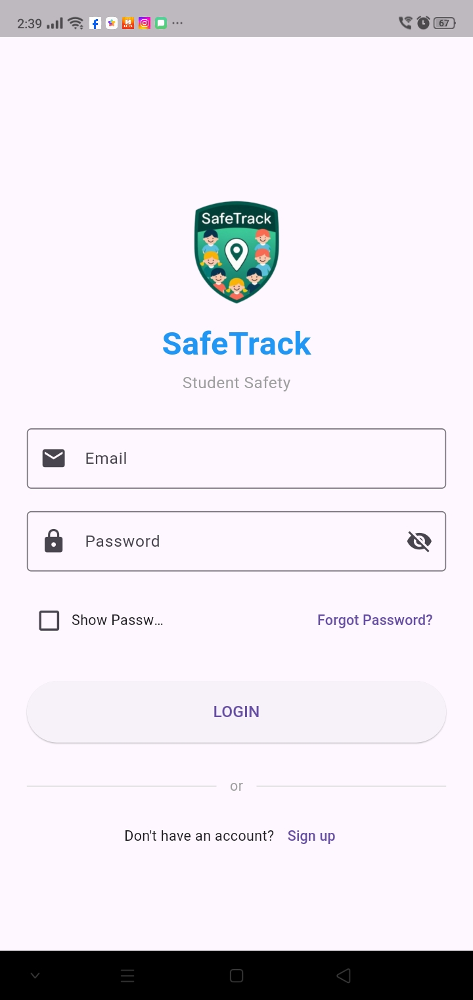 | 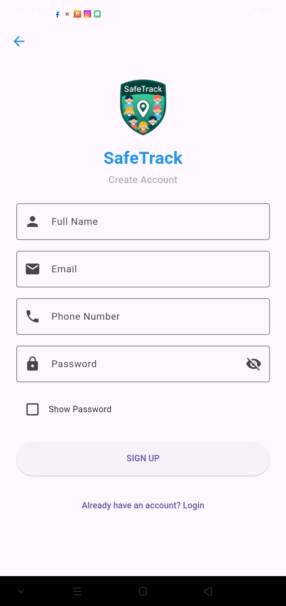 | 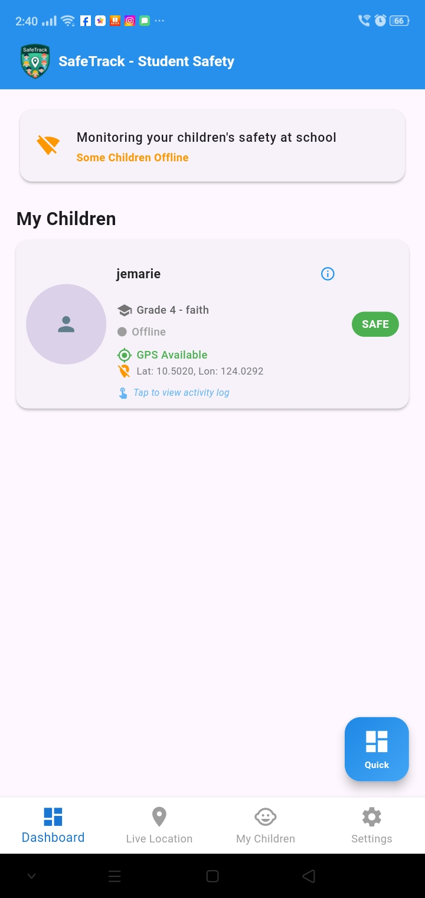 |
| Login screen with email, password, and forgot password | Create account with name, email, phone, password | Overview of all linked children with status cards |

| Live Location | My Children | Settings |
|:---:|:---:|:---:|
| 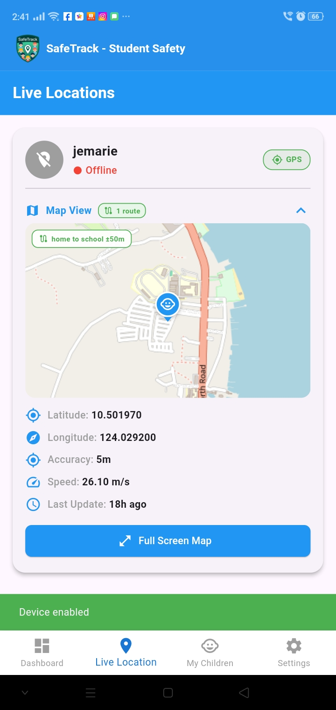 | 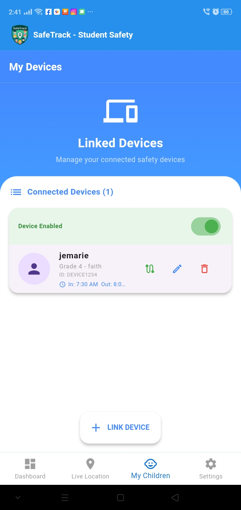 | 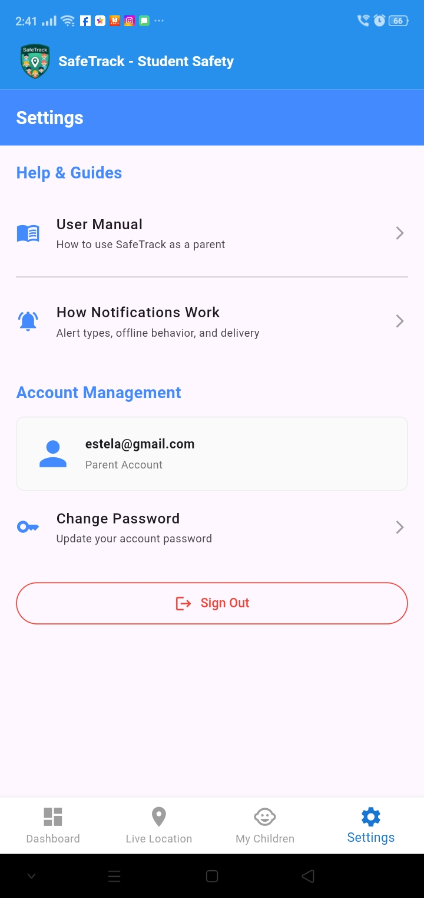 |
| Real-time map with route and deviation status | Device management, school schedule, route access | Help Center, User Manual, account management |

| Route Registration | Alerts | AI Assistant |
|:---:|:---:|:---:|
| 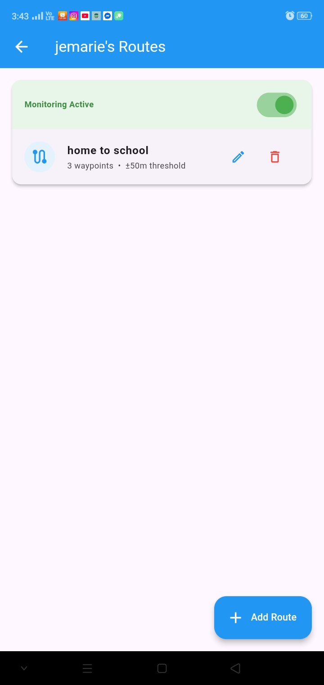 | 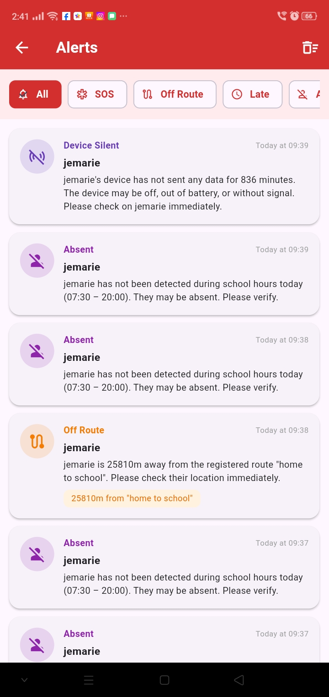 | 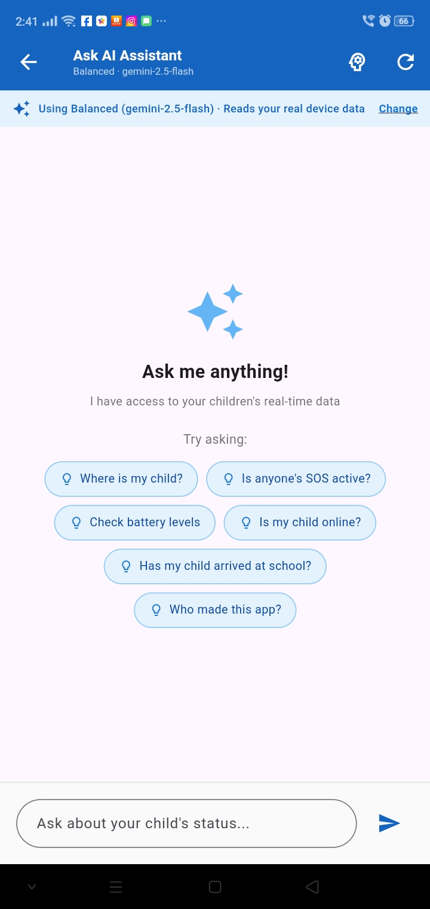 |
| Tap-to-drop waypoint editor with deviation threshold | Full alert history with 6 filter chips | Gemini AI chat with real Firebase context |

---

## Downloads

### 📱 Android APK

> **[⬇️ Download SafeTrack APK (Google Drive)](https://drive.google.com/drive/folders/1AYsSuv9e3lkmnOq0V9bhxJvm2ejC88V-)**
>
> Minimum Android version: API 21 (Android 5.0)
>
> **Install instructions:**
> 1. Download the APK on your Android phone
> 2. Settings → Security → Enable **Install from unknown sources**
> 3. Open the APK and tap **Install**
> 4. Open SafeTrack, sign up, and link your device

---

## Development Environment

| Tool | Version / Detail |
|---|---|
| Flutter SDK | ≥ 3.9.2 (Dart ≥ 3.x) |
| Python | ≥ 3.10 |
| Arduino IDE / PlatformIO | ESP32-C3 firmware development |
| Firebase Console | Project configuration and RTDB |
| Android Studio | IDE for Flutter development |
| Target Platform | Android (API 21+) |
| Database | Firebase Realtime Database |
| Notifications | Firebase Cloud Messaging (FCM) |
| AI API | Google Gemini API |
| Mapping | OpenStreetMap + Nominatim (no API key) |

---

## Repository Structure

```
SafeTrack/
├── mobile/                          ← Flutter parent application
│   └── lib/
│       ├── main.dart
│       ├── screens/
│       │   ├── dashboard_screen.dart
│       │   ├── live_location_screen.dart
│       │   ├── my_children_screen.dart
│       │   ├── route_registration_screen.dart
│       │   ├── alerts_screen.dart
│       │   ├── ask_ai_screen.dart
│       │   ├── settings_screen.dart
│       │   └── auth/
│       │       ├── login_screen.dart
│       │       └── signup_screen.dart
│       └── services/
│           ├── auth_service.dart
│           ├── notification_service.dart
│           ├── gemini_service.dart
│           ├── haversine_service.dart
│           ├── path_monitor_service.dart
│           ├── behavior_monitor_service.dart
│           └── background_monitor_service.dart
├── server/                          ← Python monitoring server
│   ├── main.py
│   ├── config.py
│   ├── requirements.txt
│   ├── serviceAccountKey.json       ← gitignored
│   ├── services/
│   │   ├── logger.py
│   │   ├── sos_monitor.py
│   │   ├── deviation_monitor.py
│   │   ├── behavior_monitor.py
│   │   └── silence_monitor.py
│   └── utils/
│       ├── haversine.py
│       └── fcm_sender.py
├── firmware/                        ← ESP32-C3 Arduino firmware
│   └── safetrack_firmware.ino
└── docs/
    ├── images/                      ← circuit diagram, 3D renders, screenshots
    ├── USER_MANUAL.md
    ├── NOTIF_TYPES.md
    ├── OFFLINE_NOTIFICATIONS.md
    ├── PROS_CONS.md
    └── GITHUB_PR.md
```

---

## Acknowledgments

- Google Firebase for real-time cloud infrastructure and FCM
- Google Gemini for AI API access
- OpenStreetMap and Nominatim contributors for open mapping and geocoding
- The Flutter, ESP32, and Python open-source communities