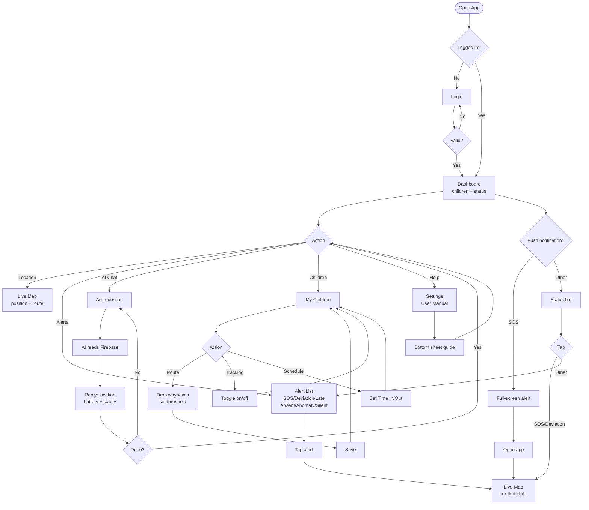
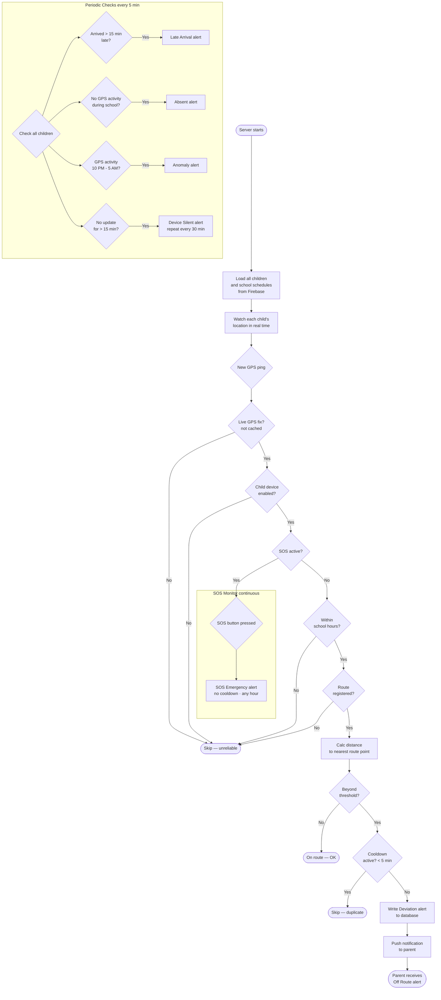

# SafeTrack — App, Firmware & Server Flows

---

## APP_FLOW — Mobile App

```mermaid
flowchart TD
    A([Open App]) --> B{Logged in?}
    B -- No --> C[Login] --> D{Valid?}
    D -- No --> C
    D -- Yes --> G
    B -- Yes --> G[Dashboard<br/>children + status]

    G --> I{Action}
    G --> AF{Push notification?}

    I -- Location --> J[Live Map<br/>position + route]
    I -- Alerts --> L[Alert List<br/>SOS/Deviation/Late<br/>Absent/Anomaly/Silent] --> N[Tap alert] --> O[Live Map<br/>for that child]
    I -- AI Chat --> P[Ask question] --> R[AI reads Firebase] --> S[Reply: location<br/>battery + safety] --> T{Done?}
    T -- No --> P
    T -- Yes --> I
    I -- Children --> U[My Children]
    U --> V{Action}
    V -- Route --> W[Drop waypoints<br/>set threshold] --> Z[Save] --> U
    V -- Tracking --> AA[Toggle on/off] --> U
    V -- Schedule --> AB[Set Time In/Out] --> U
    I -- Help --> AC[Settings<br/>User Manual] --> AE[Bottom sheet guide] --> I

    AF -- SOS --> AG[Full-screen alert] --> AH[Open app] --> O
    AF -- Other --> AI[Status bar] --> AJ{Tap}
    AJ -- SOS/Deviation --> O
    AJ -- Other --> L
```

---

## FIRMWARE_FLOW — ESP32 Device

```mermaid
flowchart TD
    A([Device powers on]) --> B[Connect to cellular network]
    B --> C{Device ID<br/>recognized?}
    C -- No --> D[Red LED<br/>Halt]
    C -- Yes --> E[Green LED<br/>Ready]

    E --> F[Read GPS fix]
    F --> G{Valid<br/>GPS fix?}
    G -- No --> H[Use cached<br/>last position] --> I
    G -- Yes --> I[Read battery level]
    I --> J[Build JSON payload<br/>lat · lng · alt · speed<br/>battery · type · timestamp]
    J --> K[Send to Firebase<br/>via 4G]
    K --> L{SOS button<br/>pressed?}
    L -- Yes --> M[Set SOS flag<br/>in payload] --> K
    L -- No --> N[Wait 2 minutes]
    N --> F
```

---

## SERVER_FLOW — Python Backend

```mermaid
flowchart TD
    A([Server starts]) --> B[Load all children<br/>and school schedules<br/>from Firebase]
    B --> C[Watch each child's<br/>location in real time]

    C --> D{New GPS ping}
    D --> E{Live GPS fix?<br/>not cached}
    E -- No --> F([Skip — unreliable])
    E -- Yes --> G{Child device<br/>enabled?}
    G -- No --> F
    G -- Yes --> H{SOS active?}
    H -- Yes --> SOS
    H -- No --> I{Within<br/>school hours?}
    I -- No --> F
    I -- Yes --> J{Route<br/>registered?}
    J -- No --> F
    J -- Yes --> K[Calc distance<br/>to nearest route point]
    K --> L{Beyond<br/>threshold?}
    L -- No --> M([On route — OK])
    L -- Yes --> N{Cooldown<br/>active? < 5 min}
    N -- Yes --> O([Skip — duplicate])
    N -- No --> P[Write Deviation alert<br/>to database] --> Q[Push notification<br/>to parent] --> R([Parent receives<br/>Off Route alert])

    subgraph Periodic Checks every 5 min
        PC{Check all children}
        PC --> LA{Arrived > 15 min<br/>late?} -- Yes --> LA2[Late Arrival alert]
        PC --> AB{No GPS activity<br/>during school?} -- Yes --> AB2[Absent alert]
        PC --> AN{GPS activity<br/>10 PM - 5 AM?} -- Yes --> AN2[Anomaly alert]
        PC --> SI{No update<br/>for > 15 min?} -- Yes --> SI2[Device Silent alert<br/>repeat every 30 min]
    end

    subgraph SOS Monitor continuous
        SOS{SOS button pressed} --> SOS2[SOS Emergency alert<br/>no cooldown · any hour]
    end
```