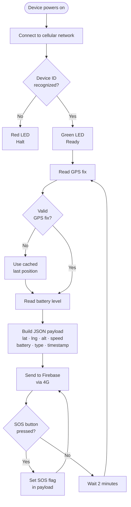

# SafeTrack — App, Firmware & Server Flows

---

## APP_FLOW — Mobile App


---

## FIRMWARE_FLOW — ESP32 Device



---

## SERVER_FLOW — Python Backend

```mermaid
flowchart TD
    A([Server starts]) --> B[Initialize Firebase<br/>Admin SDK]
    B --> C[Run initial behavior<br/>and silence checks<br/>immediately on startup]
    C --> D[Spawn three<br/>background threads]

    D --> T1[Thread: SosMonitor<br/>attaches RTDB listener<br/>runs continuously]
    D --> T2[Thread: DeviationMonitor<br/>attaches RTDB listener<br/>runs continuously]
    D --> T3[Thread: CronRunner<br/>runs every 5 minutes]

    subgraph DeviationMonitor — real-time RTDB listener
        DM1{New GPS ping<br/>received}
        DM1 --> DM2{Live GPS fix?<br/>not cached}
        DM2 -- No --> DM3([Skip — unreliable])
        DM2 -- Yes --> DM4{Device<br/>enabled?}
        DM4 -- No --> DM3
        DM4 -- Yes --> DM5{SOS active?}
        DM5 -- Yes --> DM3
        DM5 -- No --> DM6{Within<br/>school hours?}
        DM6 -- No --> DM3
        DM6 -- Yes --> DM7{Route<br/>registered?}
        DM7 -- No --> DM3
        DM7 -- Yes --> DM8[Calc distance to<br/>nearest route point]
        DM8 --> DM9{Beyond<br/>threshold?}
        DM9 -- No --> DM10([On route — OK])
        DM9 -- Yes --> DM11{Cooldown<br/>active? < 5 min}
        DM11 -- Yes --> DM12([Skip — duplicate])
        DM11 -- No --> DM13[Write Deviation alert] --> DM14[Push notification<br/>to parent]
    end

    subgraph SosMonitor — real-time RTDB listener
        SM1{SOS flag set<br/>on device}
        SM1 --> SM2[Write SOS alert<br/>immediately]
        SM2 --> SM3[Push notification<br/>no cooldown · any hour]
    end

    subgraph CronRunner — every 5 min
        CR1[Run behavior checks] --> CR2[Run silence checks]
        CR1 --> CR3{Late?<br/>> 15 min grace} -- Yes --> CR4[Late Arrival alert]
        CR1 --> CR5{Absent?<br/>no GPS all day} -- Yes --> CR6[Absent alert]
        CR1 --> CR7{Anomaly?<br/>10 PM - 5 AM} -- Yes --> CR8[Anomaly alert]
        CR2 --> CR9{Silent?<br/>> 15 min no update} -- Yes --> CR10[Device Silent alert<br/>re-alert every 30 min]
    end
```