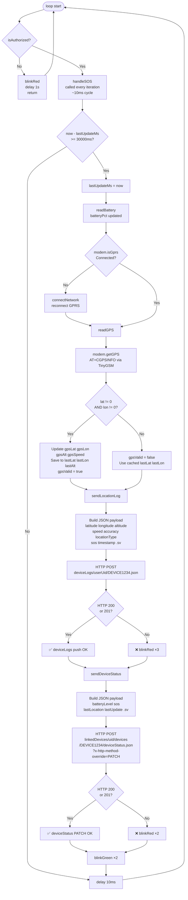
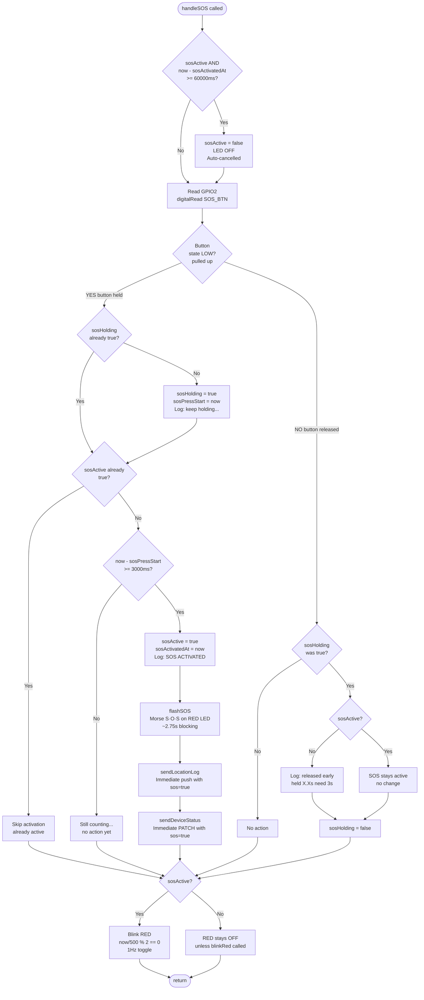
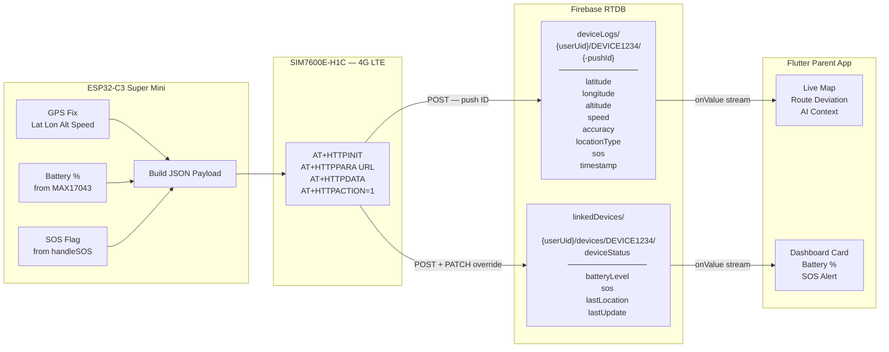
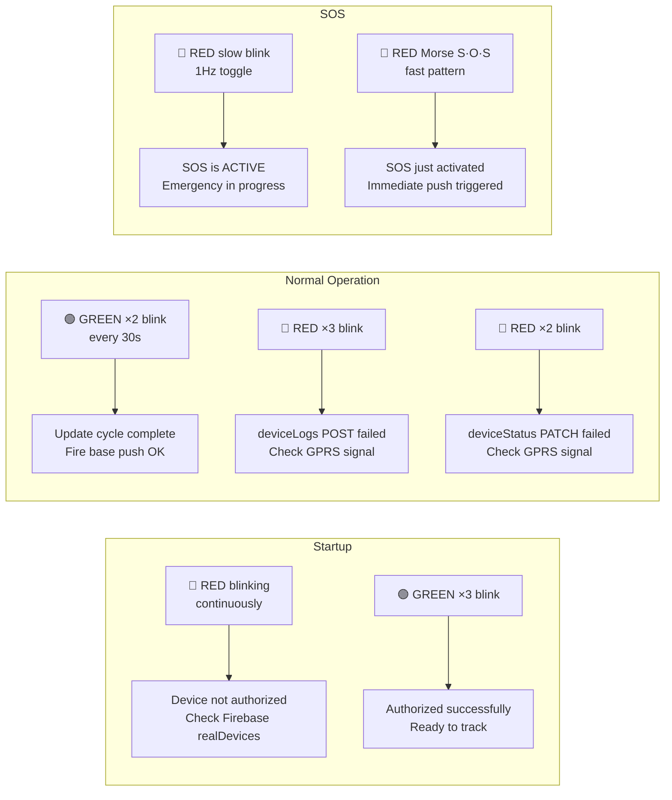
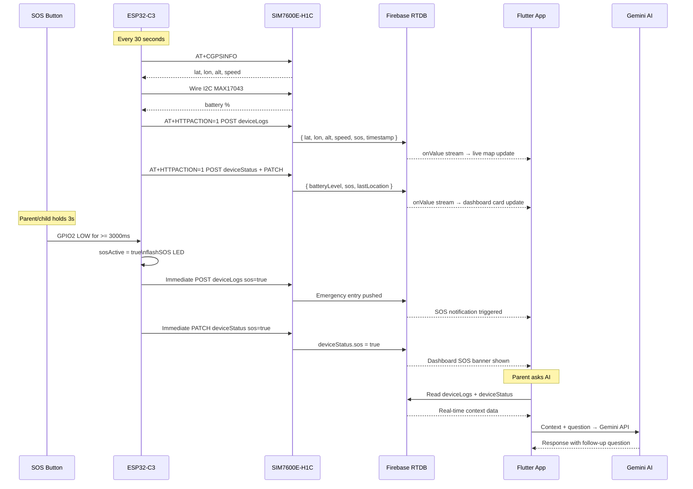

# SafeTrack ESP32-C3 Firmware — Flow Diagrams

> **Firmware Version:** 4.2 | **Hardware:** ESP32-C3 Super Mini + SIM7600E-H1C

---

## 1. Boot / Setup Flow

```mermaid
flowchart TD
    A([Power ON]) --> B[Serial Monitor begin 115200]
    B --> C[Init GPIO\nRED_PIN=8 OUT\nGRN_PIN=3 OUT\nSOS_BTN=2 INPUT_PULLUP]
    C --> D[Init I2C\nSDA=6 SCL=7]
    D --> E[initMAX17043\nQuick-start command\nvia Wire I2C]
    E --> F[readBattery\nRead SOC register 0x04\nReturn batteryPct %]
    F --> G[Start UART1\nRX=20 TX=21\n115200 baud]
    G --> H[modem.restart\nAT+CRESET]
    H --> I{Modem OK?}
    I -- No --> J[⚠️ Log warning\nContinue anyway]
    I -- Yes --> K[modem.enableGPS\nAT+CGPS=1]
    J --> K
    K --> L[connectNetwork]

    L --> L1{GPRS already\nconnected?}
    L1 -- Yes --> L4
    L1 -- No --> L2[modem.waitForNetwork\n30s timeout]
    L2 --> L3{Network\nregistered?}
    L3 -- No --> L_fail[❌ Log timeout\nReturn — no GPRS]
    L3 -- Yes --> L4[modem.gprsConnect\nAPN: http.globe.com.ph]
    L4 --> L5{GPRS\nconnected?}
    L5 -- No --> L_fail2[❌ Log failure]
    L5 -- Yes --> L6[✅ Log IP address]

    L6 --> M[authenticateDevice]
    L_fail --> M
    L_fail2 --> M

    M --> M1[HTTP GET\nrealDevices.json]
    M1 --> M2{Response\n200 OK?}
    M2 -- No --> M_fail[❌ Empty response]
    M2 -- Yes --> M3[Parse JSON\nloop all entries]
    M3 --> M4{deviceCode\nmatches\nDEVICE_CODE?}
    M4 -- No --> M3
    M4 -- Yes --> M5{actionOwnerID\npresent and\nnot null?}
    M5 -- No --> M_fail
    M5 -- Yes --> M6[Set userUid\nSet deviceUid\nReturn true]

    M_fail --> AUTH_FAIL[❌ Not authorized\nBlink RED forever\nHALT]
    M6 --> AUTH_OK[✅ isAuthorized = true\nBlink GREEN ×3]
    AUTH_OK --> LOOP([Enter loop])
```



---

## 2. Main Loop Flow



---

## 3. SOS Handler Flow

> Called on **every loop iteration** (~every 10ms). Non-blocking — uses `millis()` only, no `delay()`.



---

## 4. Firebase Write Flow



---

## 5. Device Authentication Flow

```mermaid
flowchart TD
    A([authenticateDevice called]) --> B[HTTP GET\nfirebaseURL/realDevices.json]
    B --> C{HTTP 200?}
    C -- No --> FAIL([return false])
    C -- Yes --> D[Read response body\nAT+HTTPREAD=0,4096]
    D --> E[Extract JSON\nbetween first { and last }]
    E --> F{JSON parse\nsuccessful?}
    F -- No --> FAIL
    F -- Yes --> G[Loop each entry\nin realDevices object]
    G --> H{Has key\ndeviceCode?}
    H -- No --> G
    H -- Yes --> I{deviceCode ==\nDEVICE_CODE\nconstant?}
    I -- No --> G
    I -- Yes --> J{Has key\nactionOwnerID?}
    J -- No --> FAIL
    J -- Yes --> K{actionOwnerID\nnot empty\nnot null?}
    K -- No --> FAIL
    K -- Yes --> L[deviceUid = entry key\nuserUid = actionOwnerID]
    L --> SUCCESS([return true])
```

---

## 6. LED Status Code Reference



---

## 7. Data Flow Summary

