# SafeTrack ESP32-C3 Firmware — Flow Diagrams v4.4

> **Firmware Version:** 4.4 (GPRS-Resilient Build)
> **Key changes from v4.2:** SOS retry queue, non-blocking GPRS check, honest LED feedback, GPRS guards

---

## 1. Boot / Setup Flow

```mermaid
flowchart TD
    A([Power ON]) --> B[Serial Monitor 115200]
    B --> C[GPIO Init<br/>RED=8 OUT · GRN=3 OUT<br/>SOS_BTN=2 INPUT_PULLUP]
    C --> D[I2C Init<br/>SDA=6 · SCL=7]
    D --> E[initMAX17043<br/>Quick-start via Wire]
    E --> F[readBattery<br/>SOC register 0x04<br/>batteryPct = 0–100%]
    F --> G[UART1 Start<br/>RX=20 · TX=21 · 115200]
    G --> H[modem.restart<br/>AT+CRESET]
    H --> I{Modem OK?}
    I -- No --> J[⚠️ Log warning<br/>Continue anyway]
    I -- Yes --> K
    J --> K[modem.enableGPS<br/>AT+CGPS=1]
    K --> L[connectNetwork]

    L --> L1{isGprsConnected?}
    L1 -- Yes --> L5[Already connected]
    L1 -- No --> L2[waitForNetwork<br/>30s timeout]
    L2 --> L3{Registered?}
    L3 -- No --> L4[❌ Timeout<br/>Return — no GPRS]
    L3 -- Yes --> L4b[gprsConnect APN]
    L4b --> L5

    L4 --> M[authenticateDevice]
    L5 --> M

    M --> M1[HTTP GET<br/>realDevices.json]
    M1 --> M2{200 OK?}
    M2 -- No --> FAIL[❌ Empty response]
    M2 -- Yes --> M3[Parse JSON<br/>Loop entries]
    M3 --> M4{deviceCode<br/>matches?}
    M4 -- No --> M3
    M4 -- Yes --> M5{actionOwnerID<br/>exists?}
    M5 -- No --> FAIL
    M5 -- Yes --> M6[userUid = actionOwnerID<br/>deviceUid = entry key]

    FAIL --> HALT[❌ Not Authorized<br/>Blink RED forever<br/>HALT]
    M6 --> OK[✅ isAuthorized = true<br/>GREEN ×3 blink]
    OK --> LOOP([Enter Main Loop])
```

---

## 2. Main Loop — Full Cycle

> Every iteration ≈ 10ms. SOS checked every iteration. Firebase update every 30s.

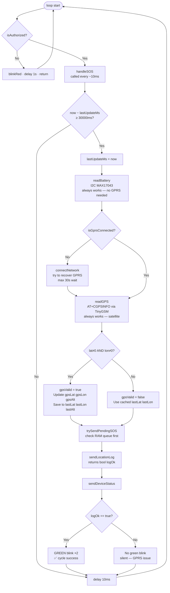

---

## 3. GPRS State Machine

> This is the connectivity spectrum — not just on/off.

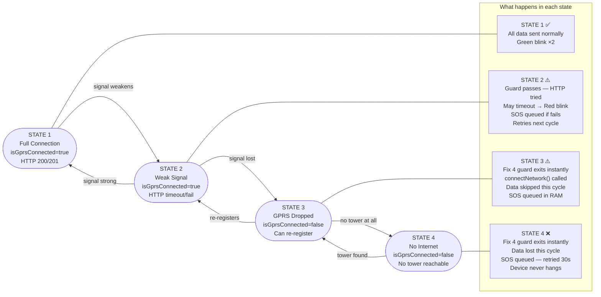

---

## 4. sendLocationLog — With GPRS Guard

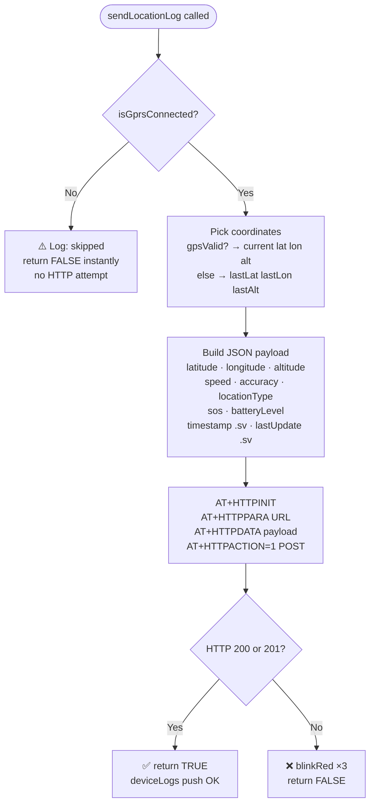

---

## 5. sendDeviceStatus — With GPRS Guard

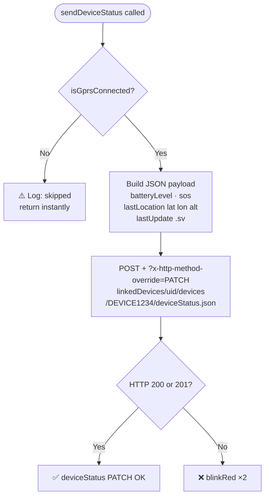

---

## 6. SOS Handler — Full Flow with GPRS Resilience

> Called every ~10ms. Non-blocking. Uses millis() only — no delay().

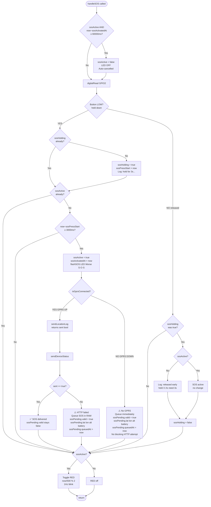

---

## 7. trySendPendingSOS — Retry Queue

> Called at the start of every 30s update cycle.

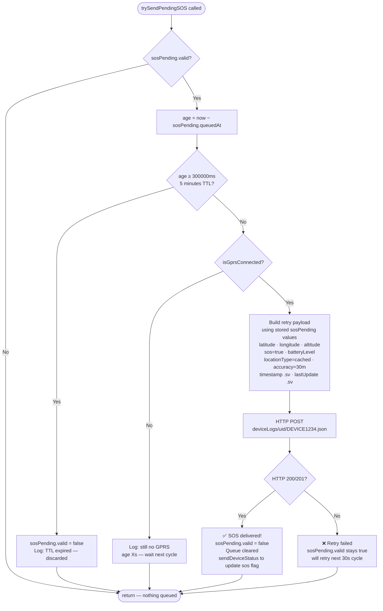

---

## 8. What Keeps Working Without Internet

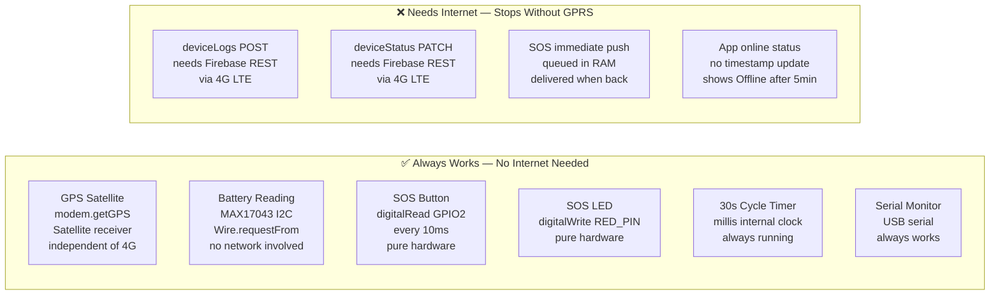

---

## 9. Full End-to-End Data Flow — v4.4

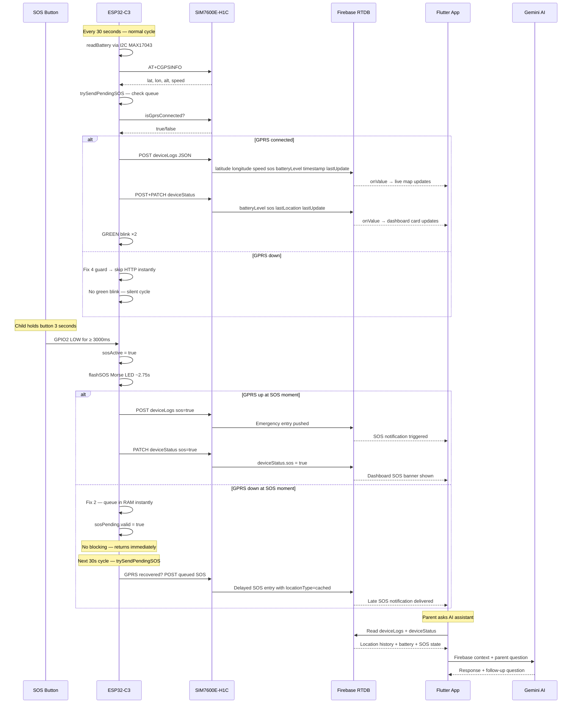

---

## 10. LED Indicator Reference — v4.4

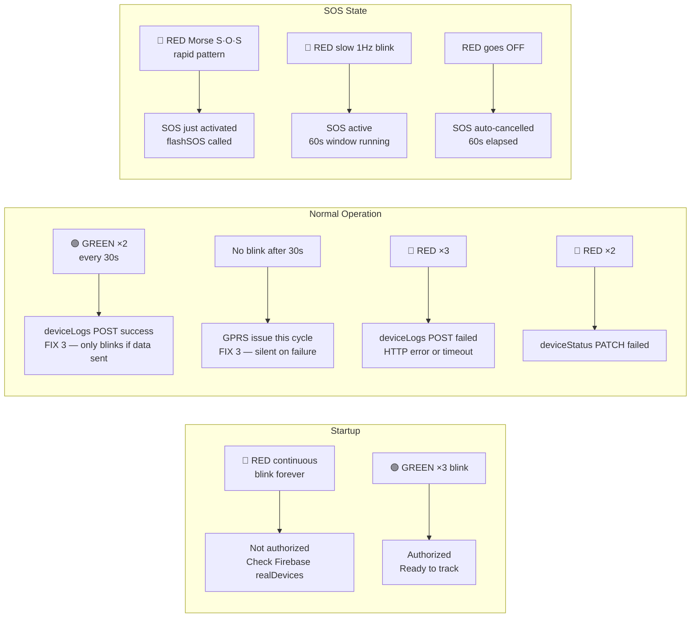

---

## 11. SOS Retry Queue — State Machine

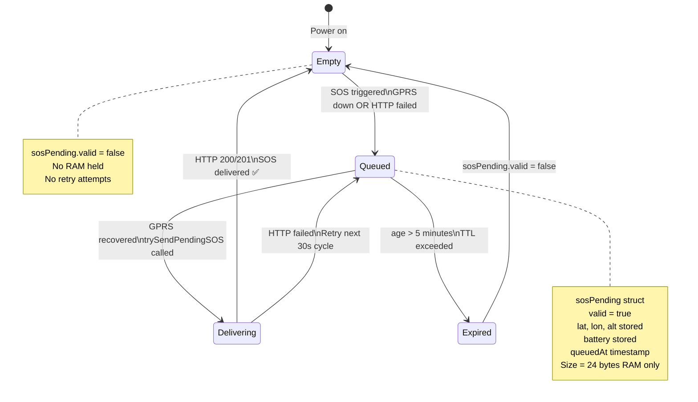